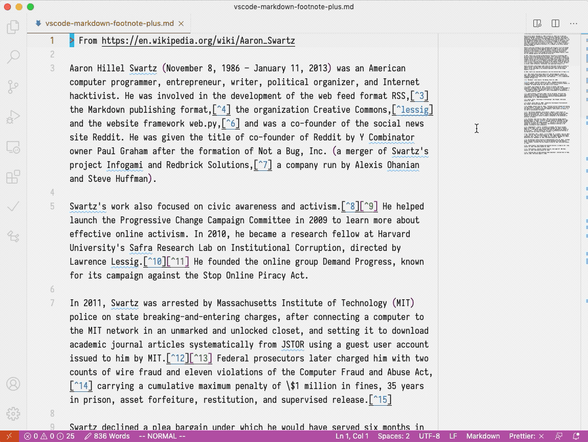
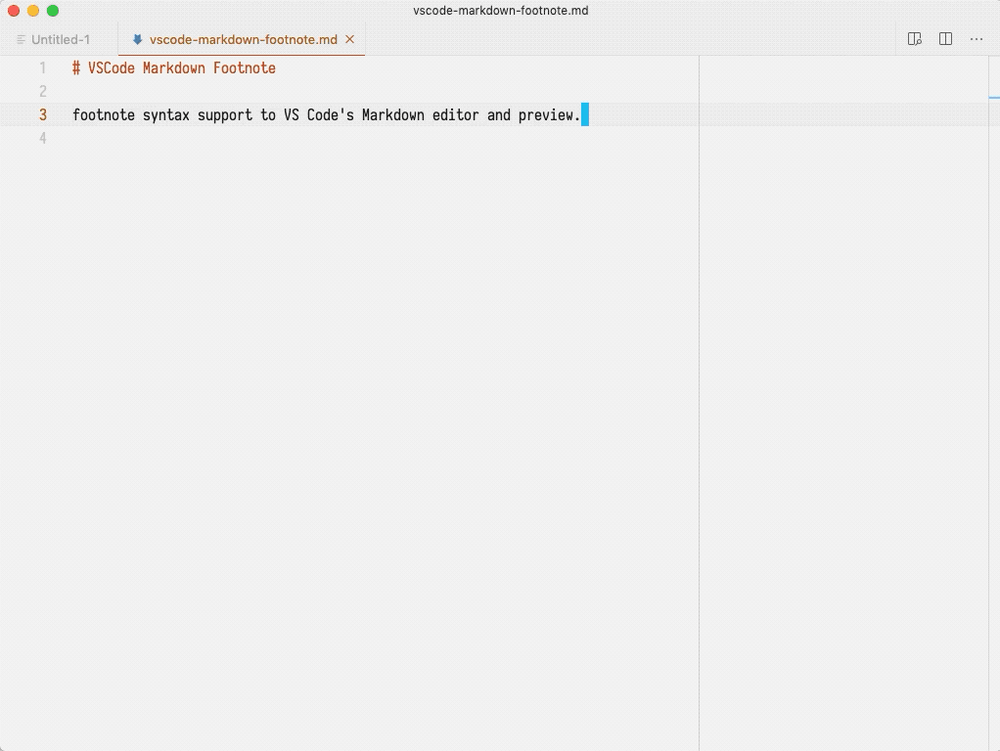
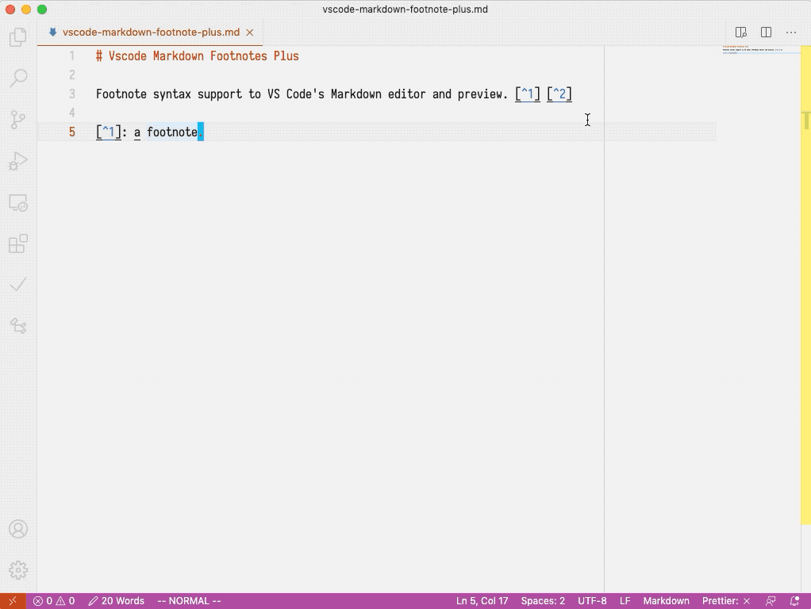
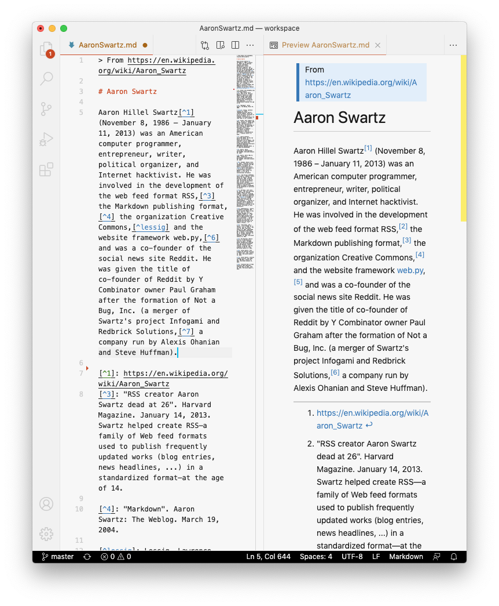

# Vscode Markdown Footnote

`[^1]` [footnote syntax](https://www.markdownguide.org/extended-syntax/#footnotes) support to VS Code's Markdown editor and preview.

## Features

- Hover to preview and jump between footnote reference and content by <kbd>cmd</kbd> / <kbd>ctrl</kbd> + <kbd>click</kbd>.
  

- Command for inserting new footnote.
  

- Create content for a footnote reference by <kbd>cmd</kbd> / <kbd>ctrl</kbd> + <kbd>click</kbd>.
  

- Render footnotes in the built-in markdown preview.
  

### TODO

- Support multiline footnote content.

## Contributing

- File bugs, feature requests in [GitHub Issues](https://github.com/houkanshan/vscode-markdown-footnote/issues).
- Leave a review on [Visual Studio Marketplace](https://marketplace.visualstudio.com/items?itemName=houkanshan.vscode-markdown-footnote&ssr=false#review-details).

### Dev

- Fork this repository
- `npm install`
- Create your feature branch: `git checkout -b my-new-feature`
- Make changes and add tests
- `npm test:watch` and check your changes by pressing `F5`
- Commit your changes: `git commit -am 'feat: Add some feature'`
- Push to the branch: `git push origin my-new-feature`
- Submit a pull request

## Thanks

- [Markdown Footnotes](https://github.com/mjbvz/vscode-markdown-footnotes)
- [Markdown Memo](https://github.com/svsool/vscode-memo)
