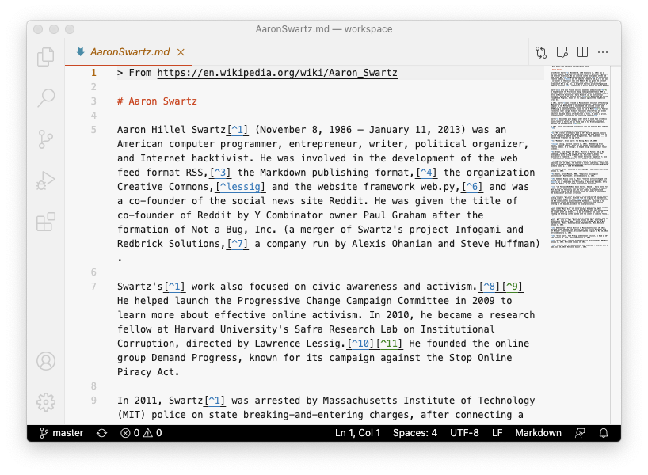
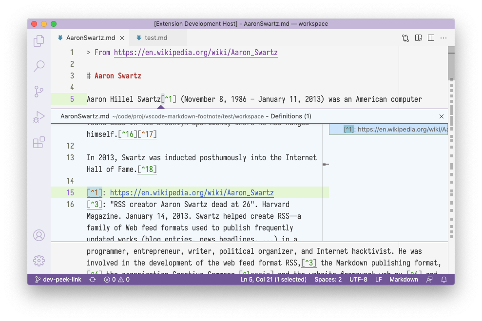
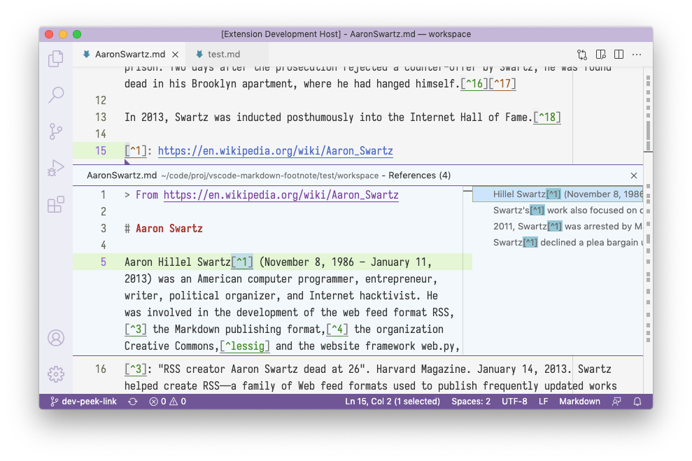
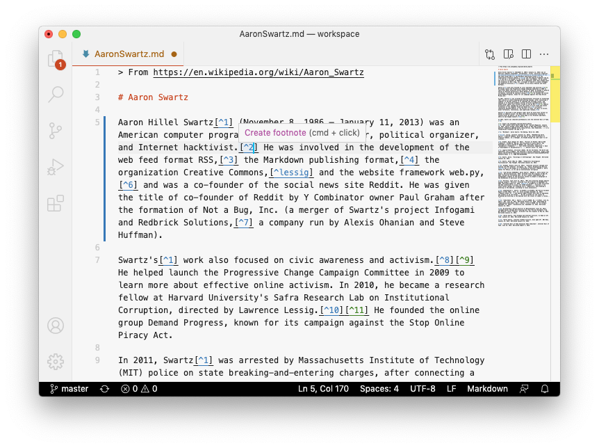
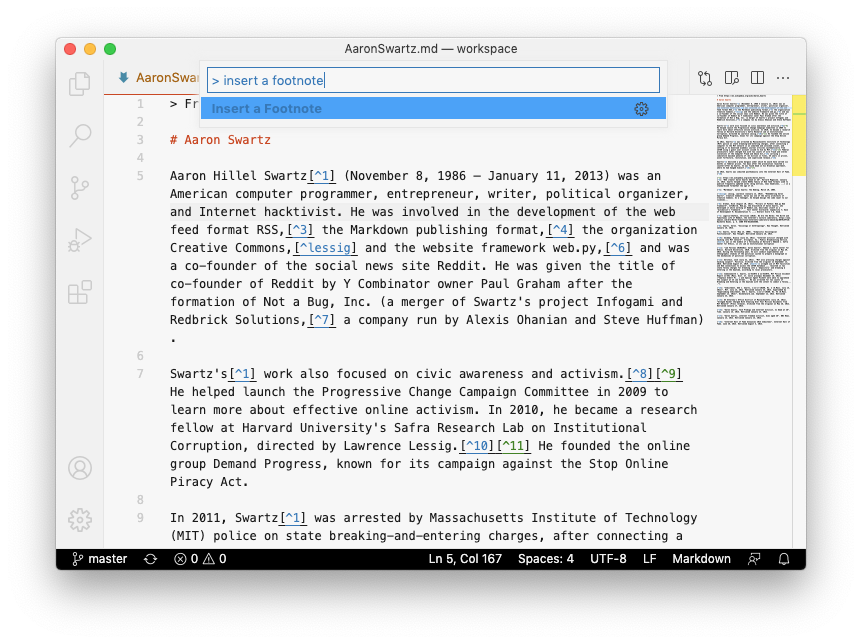
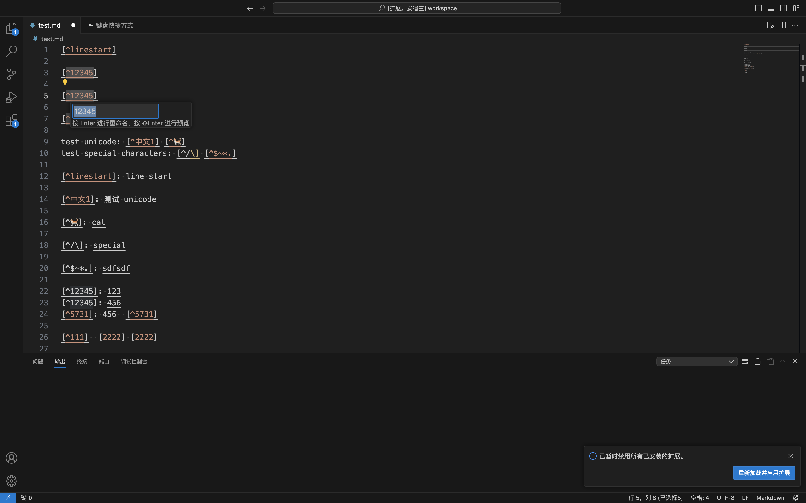

  

<h1 align="center" style="margin-top: 0">VSCode Markdown Footnote</h1>

`[^1]` [footnote syntax](https://www.markdownguide.org/extended-syntax/#footnotes) support to VS Code's Markdown editor and preview.

## 功能

* 通过 <kbd>cmd</kbd> / <kbd>ctrl</kbd> + <kbd>click</kbd> 可以悬停以预览并在脚注引用和内容之间跳转。

* 提供编辑和预览的 Peek 编辑器功能。

* 提供插入新脚注的命令。

* 在内置的 Markdown 预览中呈现脚注。

* 直接在编辑器中重命名脚注。

注：该插件基于原插件更新[vscode-markdown-footnote](https://github.com/houkanshan/vscode-markdown-footnote)

## Changelog

* 231006 更新 V1.1.0 增加脚注修改功能
